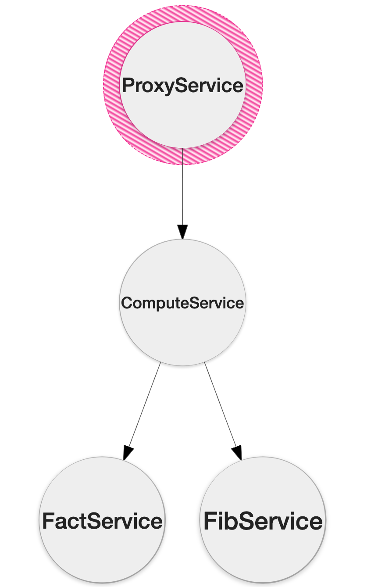

# Performance Bottleneck-Localization for microservices

The below image presents deep-dependency (or overall microservice flow) between the microservices defined in this repository.
<p align="center">
  
</p>

The repository consists of 18 microservices connected in star topology. The primary microservice is the ProxyService. All the microservices are instrumented to emit distributed traces to jaeger. 

To install and setup jaeger (localhost), use the following command:
```bash
docker run -d --name jaeger \
  -e COLLECTOR_ZIPKIN_HTTP_PORT=9411 \
  -p 5775:5775/udp \
  -p 6831:6831/udp \
  -p 6832:6832/udp \
  -p 5778:5778 \
  -p 16686:16686 \
  -p 14268:14268 \
  -p 9411:9411 \
  jaegertracing/all-in-one:1.8
```
The primary microservice: ProxyService runs on port 8000 and exposes the following endpoints
```
/api/proxy/fib
/api/proxy/fib1
/api/proxy/fib2
/api/proxy/fib3
/api/proxy/fib4
/api/proxy/fib5
/api/proxy/fib6
/api/proxy/fib7
/api/proxy/fact
/api/proxy/fact1
/api/proxy/fact2
/api/proxy/fact3
/api/proxy/fact4
/api/proxy/fact5
/api/proxy/fact6
/api/proxy/fact7
```

The bottleneck localiser runs on port 3000 and is accessable by the following curl command:
```
curl --location --request GET 'localhost:3000/getbottleneck?service=ProxyService&startTime=1607222258233000&endTime=1607225858233000&host=localhost'
```
